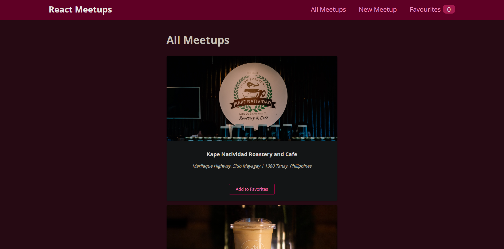

# Meetups

## Output



## Links

- Live Site URL: [meetup-locations-project](https://meetup-locations-project.netlify.app)

## Built with

- Semantic HTML5 markup
- React CSS Modules custom properties
- Context
- [React](https://reactjs.org/) - JS library
- [Firebase](https://firebase.google.com) - Firestore Database

### Learned how to use Context
```js
const root = ReactDOM.createRoot(document.getElementById('root'));
root.render(
  <MeetupsContextProvider>
    <FavoritesContextProvider>
      <BrowserRouter>
        <App />
      </BrowserRouter>
    </FavoritesContextProvider>
  </MeetupsContextProvider>
);
```

