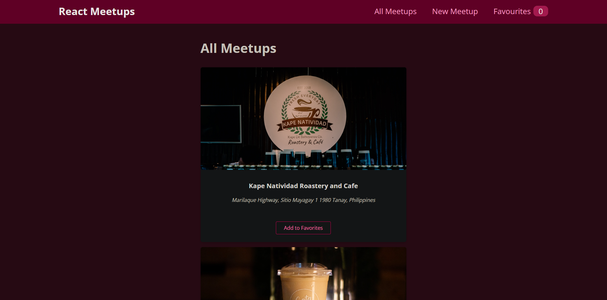

# Meetups

A React learning project for meetup listings and favorites, using Firebase and Context-based state. The source includes all-meetups, new-meetup, and favorites pages.

## Output



## Links

- Historical demo: `https://meetup-locations-project.netlify.app` — returned HTTP 404 during the repository audit; not a working demo link.

## Built with

- Semantic HTML5 markup
- React CSS Modules custom properties
- Context
- [React](https://reactjs.org/) - JS library
- [Firebase](https://firebase.google.com) - Firestore Database

### Learned how to use Context
```js
const root = ReactDOM.createRoot(document.getElementById('root'));
root.render(
  <MeetupsContextProvider>
    <FavoritesContextProvider>
      <BrowserRouter>
        <App />
      </BrowserRouter>
    </FavoritesContextProvider>
  </MeetupsContextProvider>
);
```


## Development and service limitations

The `package.json` scripts use Create React App (`react-scripts`): `start` for development, `build` for a production bundle, and `test` for the test runner. These entry points were inspected, not executed, in this documentation review. Firebase access requires an authorized project and appropriate rules; current backend availability and write operations have not been tested.

## Deployment caution

The default branch is `master`, while the included Firebase live-deploy workflow watches pushes to `main`. A separate pull-request workflow can create Firebase previews. Do not assume a documentation change is deployment-free; resolve the intended branch and hosting configuration before release.
